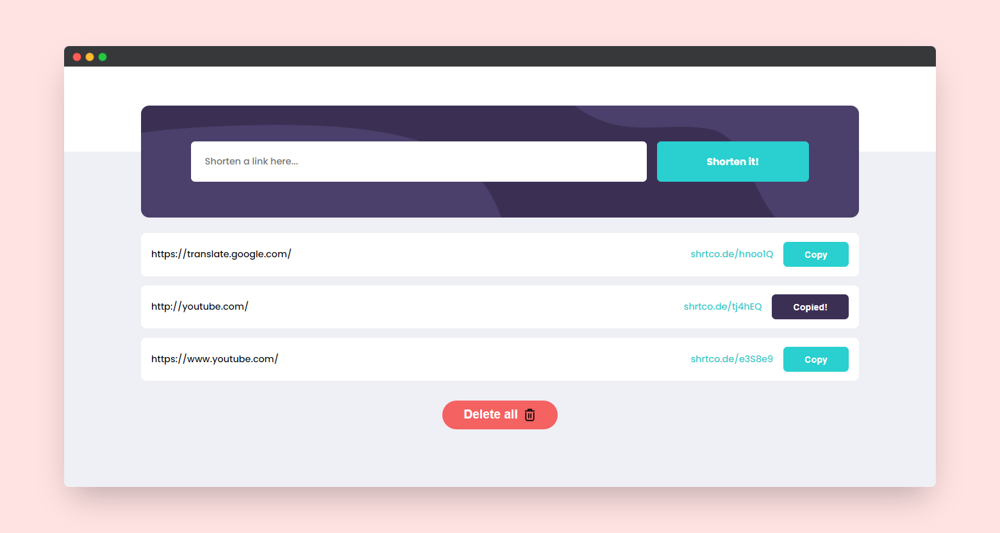

# URL Shortening API

A website for URL shortening.


## Table of Contents

- [Overview](#overview)
- [Features](#features)
- [Technologies_Used](#Technologies_Used)
- [Usage](#usage)
- [Contributing](#contributing)

## Overview

The URL Shortening API is a website that allows users to shorten long URLs and generate shortened links. It provides a convenient way to create shorter, more manageable URLs for sharing or using in various applications.

## Features

- Shorten long URLs to compact, user-friendly links
- Store shortened links in session storage for easy retrieval
- Copy shortened links to the clipboard with a single click
- View the list of previously shortened URLs.
- Delete all stored links in one go



## Technologies_Used

- HTML
- CSS
- JavaScript (No framework)

## Usage

Install dependencies `npm install`

1.Start the development server: `npm run dev`

- It will start on `http://localhost:3000` you can change it in `vite.config.js`.
- Shorten URLs by entering them into the input field and clicking the "Shorten" button.
- Copy the shortened links by clicking the "Copy" button next to each link.
- Delete individual links or clear the entire link history using the provided options.

- To build the project for production:
  ```npm run build```

- To preview the built preview:
  ```npm run preview```

## Contributing

Contributions are welcome! If you have any suggestions or feature requests, please open an issue or submit a pull request or contact me at `bxone22@gmail.com` .

View the hosted version: https://shortly-web.netlify.app/
